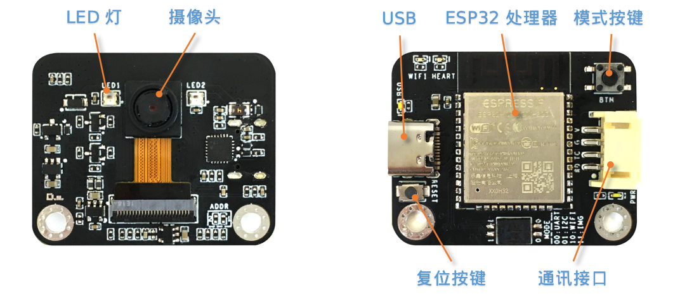
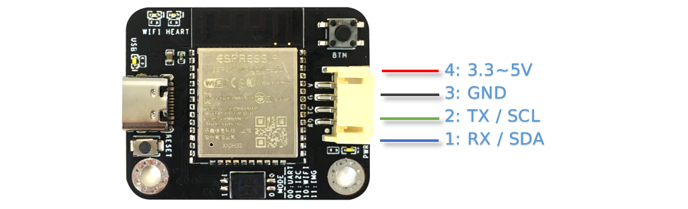
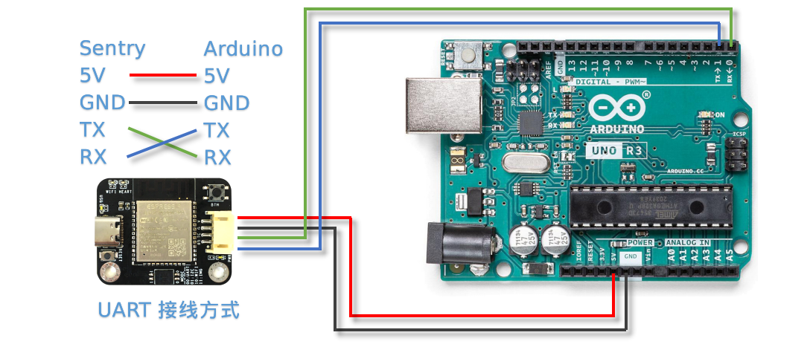
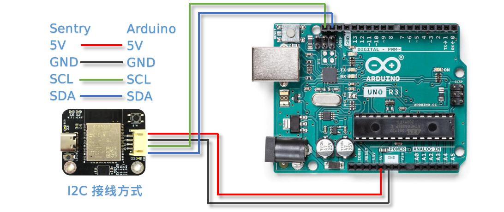
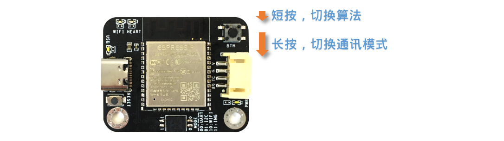
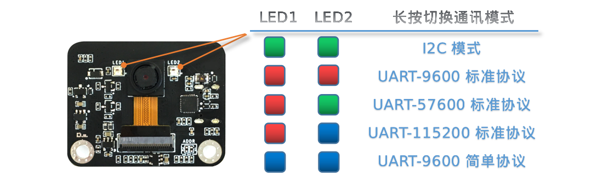
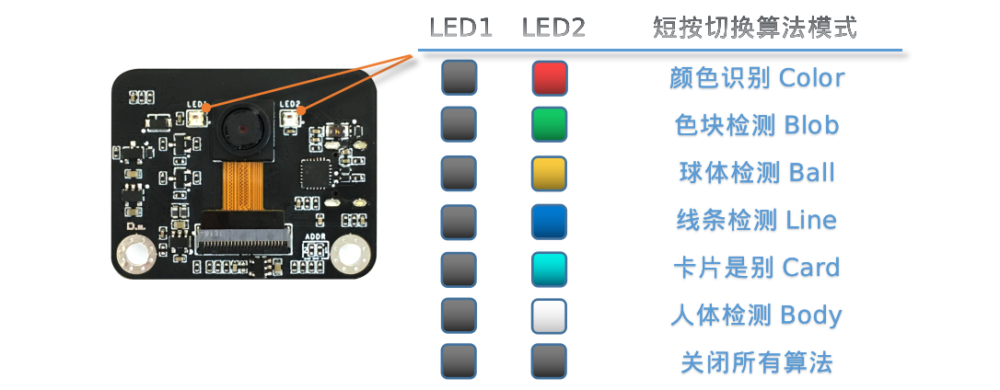

.. _chapter_vs1_hardware_index:

硬件介绍 
================

简介
----------------
Sentry1视觉传感器采用双核240MHz-ESP32处理器，可以满足入门级的视觉处理需求，适合于青少年教学与创客作品。

应用领域:智能机器人、智能小车、创客作品、STEAM教育、智能玩具

**LED灯**：通过灯光不同的颜色可以反映出不同的识别结果，当设置为白光常亮时可以当作补光灯使用

**摄像头**：实时的采集图像数据

**ESP32处理器**：双核240MHz处理器

**USB**：板载USB-UART芯片，可以直接与电脑通信与控制，同时作为固件更新接口，（**注意：USB供电会通过通讯接口对外输出，二者不可同时供电**）

**模式按键**：短按实现算法切换，长按实现通讯模式切换

**复位按键**：可实现硬件复位，特殊情况下使用

**通讯接口**：图像处理数据与主控的交互接口，支持UART和I2C方式

硬件参数
----------------

================    ================    ================    ================
项目                 单位                 参数                  备注
================    ================    ================    ================
工作电压              V                   3.3～5.0            通讯口与USB不可同时供电
工作电流              mA                  90                  5V供电，开启算法时的典型值
尺寸                 mm                  40x32x12.5          不带外壳
重量                 g                   9                   不带外壳
定位孔间距            mm                  32
定位孔直径            mm                  3
摄像头类型            NA                  CMOS
摄像头分辨率          像素                 200W
摄像头帧率            fps                 25
镜头视场角            度°                  68                                 
================    ================    ================    ================   

算法列表
----------------

算法详细介绍可参阅:
:ref:`算法介绍<chapter_vs1_vision_index>`
章节

================    ================================================    ================      ================================
算法ID               名称                                                 英文名称                   简介                                                                                                                           
================    ================================================    ================      ================================
1                    :ref:`颜色识别<chapter_vs1_vision_color_index>`          Color                  可设置识别区域，返回区域中的颜色信息，如R，G，B值及分类标签
2                    :ref:`色块检测<chapter_vs1_vision_blob_index>`           Blob                   检测图像中是否有指定的色块，支持黑、白、红、绿、蓝、黄6种色块检测
3                    :ref:`球体识别<chapter_vs1_vision_ball_index>`           Ball                   可以检测识别橙色乒乓球或者绿色的网球
4                    :ref:`线条检测<chapter_vs1_vision_line_index>`           Line                   检测图像中的线条，返回两个端点坐标及倾斜角度
6                    :ref:`卡片识别<chapter_vs1_vision_card_index>`           Card                   识别特制的5张交通卡片图案，包含前进，左转、右转、调头和停车
7                    :ref:`人体检测<chapter_vs1_vision_body_index>`           Body                   可以检测到人体
================    ================================================    ================      ================================ 

开发平台与驱动库
----------------

================================================    ================================    ================================    ========================================================================================================    ================    ================
开发平台                                              编程语言                             主控设备                            驱动库链接                                                                                                       企业版              消费版
================================================    ================================    ================================    ========================================================================================================    ================    ================
:ref:`Arduino<chapter_vs1_arduino_index>`               C/C++                                Arduino                            https://github.com/AITosee/Sentry-Arduino/releases                                                             支持                支持
:ref:`MakeCode<chapter_vs1_makecode_index>`             图形化                               Micro:bit                           https://github.com/AITosee/pxt-sentry/releases                                                                  支持                支持
:ref:`Mind+<chapter_vs1_mindplus_index>`                图形化，C/C++，MicroPython            Arduino、Micro:bit、掌控板             https://github.com/AITosee/ext-sentry/releases                                                                支持                支持
:ref:`Mixly<chapter_vs1_mixly_index>`                   图形化                                Arduino                             https://github.com/AITosee/Sentry-Mixly/releases                                                               支持                支持
:ref:`BXY<chapter_vs1_micropython_index>`               MicroPython                          Micro:bit、掌控板                    https://github.com/AITosee/Sentry-microPython/releases                                                         支持                支持
================================================    ================================    ================================    ========================================================================================================    ================    ================

使用说明
----------------
Sentry1视觉传感器可以通过通讯接口与主控制器相连接，也可以通过USB与电脑连接。

驱动库、固件、资料手册、第三方资源等可参阅:
:ref:`资源下载<chapter_vs1_download_index>`
章节

**注意：USB与通讯接口不可以同时供电！！！**

连接主控
************************

接口定义
^^^^^^^^^^^^^^^^^^^^^^^^^^^^^^^^

================    ================    ================    ================
引脚序号              UART模式            I2C模式              备注
================    ================    ================    ================
1                   RX                  SDA
2                   TX                  SCL
3                   GND                 GND
4                   VCC                 VCC                 注意！！！当插入USB时，此端口可以对外部设备进行供电，此端口不可直接连接电池，当插入USB时不可接入3.3V系统，需要断开供电引脚
================    ================    ================    ================

接线方式
************************
以Arduino UNO举例说明

**UART模式**

**注意：UART模式下，视觉传感器的RX需要接Arduino的TX，传感器的TX接Arduino的RX**

**注意：如果使用软串口，可以指定其他的IO口，详见Arduino中的SoftSerialExample**

**注意：由于Arduino的RX和TX与烧录固件共用端口，因此在烧录程序时，需要断开RX，TX接线，推荐使用I2C或软串口模式**

**I2C模式**

模式按键
************************

长按模式按键可以切换通讯模式，短按模式按键可以循环切换算法。不同的模式之间通过LED灯光颜色进行指示

长按切换通讯模式
^^^^^^^^^^^^^^^^^^^^^^^^^^^^^^^^
长按模式按键3秒以上，则可以切换通讯模式，目前提供5种方式：I2C模式、串口9600波特率标准协议、串口57600波特率标准协议、串口115200波特率标准协议、串口9600简单协议

每次长按后会切换一种模式并自动重启传感器，通讯方式会自动保存，下次开机后仍未该模式，不必再次切换

在开机时会闪烁2次LED灯光来表明当前是哪种通讯模式，对应颜色如下所示：

其中：

I2C模式：采用I2C总线通讯协议，具有较高的通讯效率

UART-9600标准协议、UART-57600标准协议、UART-115200标准协议：此3种模式采用串口通讯，后面的数字为不同的波特率，根据主控平台选择合适的波特率。
标准协议指带有通讯格式的指令，需要进行解析处理，一般配合驱动库使用
一般来说，波特率值越大，则越有助于减少数据通讯时间，提高处理速率，但有的主控或者使用“软串口”时无法支持高波特率

UART-9600简单协议：采用串口通讯，波特率为9600,协议为简单协议，只需发送和接收字符即可，适合于简单的应用，可以跨多种主控平台使用

短按切换算法模式
^^^^^^^^^^^^^^^^^^^^^^^^^^^^^^^^
短按模式按键可以快速切换算法，每次切换算法会自动关闭上一个算法。

算法在开启时，会闪烁2次LED来表明当前是哪种算法模式，对应颜色如下所示：

其中：

黑色表示LED处于熄灭状态

开启算法
************************

除了可以通过模式按键开启算法外，还支持通过协议指令开启算法

该方式需要由主控设备读写寄存器来实现算法的开启或关闭，我们在多个编程平台提供了封装好的驱动库给用户使用

串口模式需要依照“标准协议指令”或“简单协议指令”来读写控制，详见相关章节介绍

I2C模式可直接读写寄存器

算法开启流程如下：
    
1. 向寄存器 0x20-VISION_ID 写入要开启的算法ID号
    
2. 向寄存器 0x21-VISIO_CONF1 中写入0x01,即可开启算法，写入0x00则关闭算法

详细设置，请查询寄存器列表

检测结果
************************

通过指令读取检测结果
^^^^^^^^^^^^^^^^^^^^^^^^^^^^^^^^

该方式需要由主控设备读写寄存器来读取结果，我们在多个编程平台提供了封装好的驱动库给用户使用

串口模式需要依照“标准协议指令”或“简单协议指令”来读写控制，详见相关章节介绍

I2C模式可直接读写寄存器

识别结果读取流程如下：
    
1. 向寄存器 0x20-VISION_ID 写入要读取的算法ID号
    
2. 读取寄存器 0x34-RESULT_NUM 的值来获取当前是否检测到目标物体，例如，返回1,则表明检测到了物体，返回0则表明未检测到

3. 向寄存器 0x24-RESULT_ID 写入待读取的结果编号，例如，写入1代表读取第1组结果，Sentry1只支持单个检测结果

4. 读取寄存器 0x80~0x89 的值来获取检测结果

    ========    ========================    ========================
    地址         名称                           含义
    ========    ========================    ========================
    0x80        RESULT_DATA1_H8             检测结果1,高8位
    0x81        RESULT_DATA1_L8             检测结果1,低8位
    0x82        RESULT_DATA2_H8             检测结果2,高8位
    0x83        RESULT_DATA2_L8             检测结果2,低8位
    0x84        RESULT_DATA3_H8             检测结果3,高8位
    0x85        RESULT_DATA3_L8             检测结果3,低8位
    0x86        RESULT_DATA4_H8             检测结果4,高8位
    0x87        RESULT_DATA4_L8             检测结果4,低8位
    0x88        RESULT_DATA5_H8             检测结果5,高8位
    0x89        RESULT_DATA5_L8             检测结果5,低8位
    ========    ========================    ========================

详细设置，请查询寄存器列表

通讯协议
----------------

详见 :ref:`通讯协议<chapter_prptocol_index>` 章节

寄存器
----------------
请联系我们

技术：support@aitosee.com

销售：sales@aitosee.com
