.. _chapter_vs2_hardware_index:

Hardware 
================

Brief
----------------

Sentry2 is a vision sensor which is designed by K210 - an advanced 64-bits RISC-V neural network processor. 
This device integrates a variety of advanced vision algorithms, which can meet the basic vision processing needs.
The on-board ESP8285-WiFi chip can be programmed in Arduino IDE directly to realize online-recognition, image transmission, AIoT and other applications. 
ESP8285 can be used as a controller for K210 which is help for AI programming without external controller.

We offer 2 edition: Enterprise Edition (marked E) and Consumer Edition (marked C).

Applications: Robots, Smart Cars, Creative Design, STEAM Education, Maker, Toys, AIoT

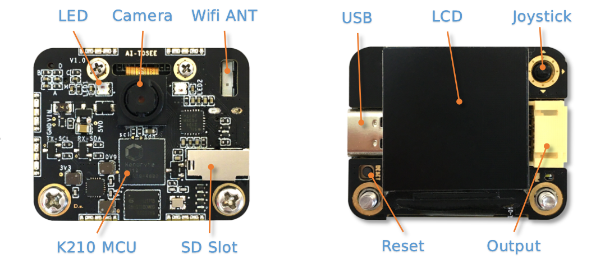

**LED**: Different colors of light can reflect different recognition results.

**Camera**: Capture image data. Users can adjust image zoom, white balance, brightness, saturation and other parameters for camera settings.

**WiFi Antenna**: An ESP8285 Wifi Chip can realize online-recognition, image transmission, AIoT applications.

**K210 Processor**: A powerful MCU with a neural network processing unit, dual-core 64-bits RISC-V processor.

**SD Slot**: Support Micro-SD(TF) card for image storage (**Note：some SD card do not support, SPI communication only**)

**USB**: The onboard USB-UART chip can directly communicate and control with the computer, and firmware update. 
(**CAUTION：the USB power supply will be output through the 4pin communication port, DO NOT powered at the same time**)

**LCD Screen**: TFT-ISP color screen with high definition and wide view brings small and excellent image display effect

**Joystick**: For UI interaction which support 5 directions control (up, down, left, right, enter)

**Reset button**: Restart the hardware

**Output Port**: A 4-pins output port for communication, support UART and I2C mode

Hardware Parameters
----------------

========================    ================    ================    ================    ================
Item                         Unit                Enterprise          Consumer            Note
========================    ================    ================    ================    ================
Voltage                      V                   3.3～5.0             3.3～5.0            DO NOT powered by USB and Communicaion Port at the same time
Current                      mA                  190                  150                5V supply and running Face vision 
Size                         mm                  40×32×12             40x32x12.5         without shell
Weight                       g                   15                   15                 without shell
Mounting Hole Spacing        mm                  32                   32
Mounting Hole Diameter       mm                  3                    3
Camera Type                  NA                  CMOS                 CMOS
Camera Resolution            pixel               500W                 200W
Camera FPS                   fps                 50                   25
Camera FOV                   degree°             70                   68                  
Screen Type                  NA                  TFT-ISP LCD          TFT-ISP LCD                   
Screen Size                  inch                1.3                  1.3            
Screen Resolution            pixel               240×240              240x240                  
========================    ================    ================    ================    ================

Vision List
----------------

Details:
:ref:`Vision<chapter_vision_index>`

================    ================================================    ================================    ================================    ====================
Vision ID            Name                                                Enterprise                          Consumer                            Brief                                                                                                                           
================    ================================================    ================================    ================================    ====================
1                    :ref:`Color<chapter_vision_color_index>`            Support                             Support                             Return the R(red),G(green),B(blue) value and its label of each region. Up to 25 regions
2                    :ref:`Blob<chapter_vision_blob_index>`              Support                             Support                             Detect a specified color block. It supports black, white, red, green, blue and yellow color blocks setection at the same time
3                    :ref:`Apriltag<chapter_vision_apriltag_index>`      Support                             Support                             Support 16H5, 25H9, 36H11 Apriltag family. Up to 25 tags
4                    :ref:`Line<chapter_vision_line_index>`              Support                             Support                             Find lines and return its endpoints and degrees, support 1-5 lines
5                    :ref:`Learning<chapter_vision_learning_index>`      Support(25 model data)              Support(15 model data)              Training objects and categorize them. Up to 25 model data
6                    :ref:`Card<chapter_vision_card_index>`              Support(traffic, shape, number)     Support(traffic)                    Identify special card patterns, including 10 traffic cards, 9 shape cards, and 10 number cards
7                    :ref:`Face<chapter_vision_face_index>`              Support(25 modeldata)               Support(15 model data)              Face detection and recognition, support mask detection, can store 25 model data
8                    :ref:`20Class<chapter_vision_20class_index>`        Support                             Support                             Classify 20 common objects, such as cat, car, human etc
9                    :ref:`QrCode<chapter_vision_qrcode_index>`          Support                             Not Support                         Recognition a simple QR code
10                   :ref:`Custom<chapter_vision_custom_index>`          Support                             Support                             Running custom algorithms which is running in the ESP8285-WiFi chip on board
11                   :ref:`Motion<chapter_vision_motion_index>`          Support                             Not Support                         Determine if there are moving areas in the image
================    ================================================    ================================    ================================    ====================

Platform and Library
----------------

================================================    ================================    ================================    ======================================================================================================== 
Platform                                             Language                            Controller                          Driver and Library                                                                                      
================================================    ================================    ================================    ======================================================================================================== 
:ref:`Arduino<chapter_arduino_index>`               C/C++                                Arduino                             https://github.com/AITosee/Sentry-Arduino/releases  
:ref:`MakeCode<chapter_makecode_index>`             Graphical                            Micro:bit                           https://github.com/AITosee/pxt-sentry/releases  
:ref:`Mind+<chapter_mindplus_index>`                Graphical，C/C++，MicroPython         Arduino、Micro:bit                  https://github.com/AITosee/ext-sentry/releases 
:ref:`Mixly<chapter_mixly_index>`                   Graphical                            Arduino                             https://github.com/AITosee/Sentry-Mixly/releases 
:ref:`BXY<chapter_micropython_index>`               MicroPython                          Micro:bit                           https://github.com/AITosee/Sentry-microPython/releases 
ARM PC                                              C/C++                                Raspberry Pie，Linux                 :download:`Sentry-Arduino-1.2.4_for_linux.zip <../Download/libs/Sentry-Arduino-1.2.4_for_linux.zip>` 
================================================    ================================    ================================    ======================================================================================================== 

How to Use
----------------

Sentry2 can be connected to the controller via the communication port or to a computer via USB.
The communication port can be set to the UART or I2C mode, the device address and baudrate can be modified.

Drivers, firmware, manuals, third-party resources:
:ref:`download<chapter_download_index>`

**CAUTION：USB and Communication Port can NOT be powered at the same time !!!**

Connect the Controller
************************

Pins Definition
^^^^^^^^^^^^^^^^^^^^^^^^^^^^^^^^

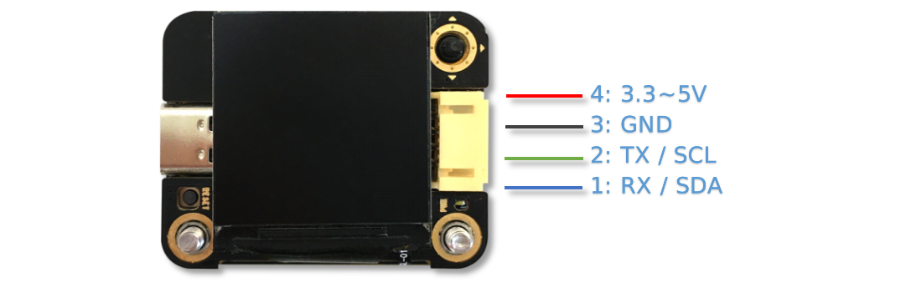

================    ================    ================    ================
Pins                UART Mode           I2C Mode            Note
================    ================    ================    ================
1                   RX                  SDA
2                   TX                  SCL
3                   GND                 GND
4                   VCC                 VCC                 CAUTION!! When the USB is inserted, this port can supply power to external devices. This port cannot be directly connected to batteries. When the USB is inserted, it cannot access the 3.3V system
================    ================    ================    ================

Connection
************************
Take Arduino UNO as an example

**UART Mode**

**NOTE: In UART Mode, make sure your connection is correct: Sentry2 RX - Arduino TX, Sentry2 TX - Arduino RX**

**NOTE: If you use a soft serial port, you can specify other I/O ports. For details, see SoftSerialExample in Arduino**

**NOTE: Because the RX and TX pins of Arduino UNO share ports with the firmware uploading, it is necessary to disconnect the RX and TX connections during the program uploading, 
and I2C or soft serial port mode is recommended**

**I2C Mode**

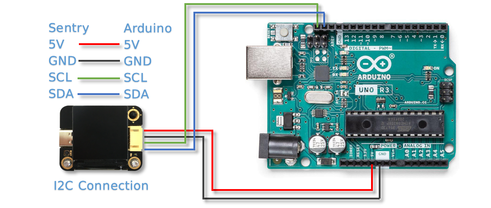

UI - User Interface
************************

Sentry2 has two kinds of UI interface: Running and Setting

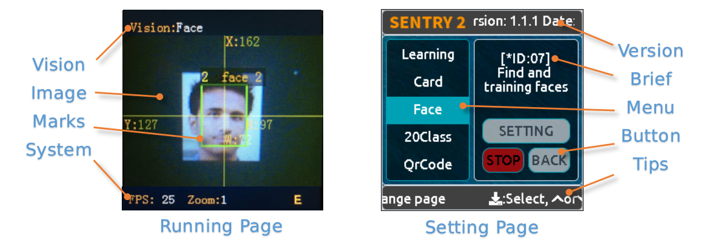

* Running

    **Vision Status**: This area is used to display the currently running algorithms

    **Image**: Display the image of the camera

    **Marks**: Mark the detected objects, including the detection box, coordinates and information

    **System Status**: Displays the frame rate, zoom level or wifi status

* Setting

    **Menus**: Toggle the joystick up and down to select menus, and vertical click to enter the setting page 

    **Version**: The firmware version and release date

    **Brief**: Describes the current menu

    **Buttons**: Interactive buttons. The button will be highlighted or displayed with blue edges if it can be operate currently

    **Tips**: Display some tips for operation instructions

UI Setting Page
^^^^^^^^^^^^^^^^^^^^^^^^^^^^^^^^

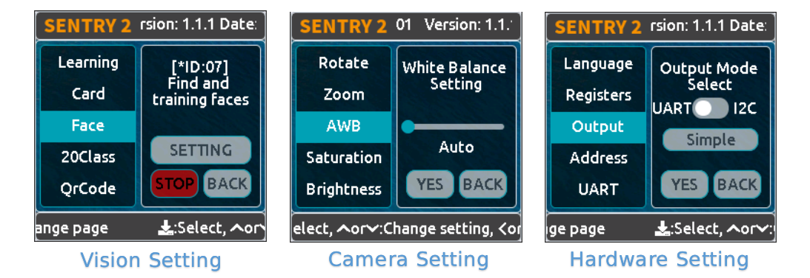

In the running page, you can click the joystick to the right to enter the UI setting page, which consists of three pages: 
vision setting, camera setting, and hardware setting 

If you turn the joystick to the left, you will exit the page one by one until you return to the running page

    **Vision Setting**: Enable or Disable visions and configurations 

    **Camera Setting**: You can setting the camera zoom, white balance, saturation and other camera settings 

    **Hardware Setting**: Used to configure the communication mode, baudrate, device address, light color, language and other parameters to adapt to different usage modes 

Hardware Setting
************************

Joystick Function Definition
^^^^^^^^^^^^^^^^^^^^^^^^^^^^^^^^

================    ============================        ================
Current Mode         Operation                            Function          
================    ============================        ================
Running              Up Click                            Switch Last Vision
Running              Down Click                          Switch Next Vision
Running              Left Click                          Snapshot(When SD is insert)
Running              Right Click                         Enter setting mode
Running              Vertical Click                      Save model data(for special visions)
Running              Upward Long Press                   Zoom In
Running              Downward Long Press                 Zoom Out
Running              Leftward Long Press                 On/Off LCD
Running              Vertical Long Press                 Delete all model data(for special visions)
...
Setting              Up Click                            Switch previous menu or button
Setting              Down Click                          Switch next menu or button
Setting              Left Click                          Switch previous setting page / back to running page
Setting              Right Click                         Switch next setting page
Setting              Vertical Click                      Enter to setting
...
Startup              Upward Press 10 seconds             Restore the default setting
Startup              Vertical Click                      K210 firmware upgrading mode
Startup              Downward Long Press                 ESP8285 firmware upgrading mode
================    ============================        ================

*NOTE: Click is short press, Long Press must be hold the button for a long time for at least 2 seconds before release*

Communication Setting
^^^^^^^^^^^^^^^^^^^^^^^^^^^^^^^^

It is used to set the communication mode between the Sentry2 and the controller, which will be automatically saved after the setting, and it is not necessary to set it again after the next startup. 
However, when the communication is abnormal, it is necessary to check whether these parameters have been changed. Sometimes, these Settings will be changed after the firmware is updated or reset the registers

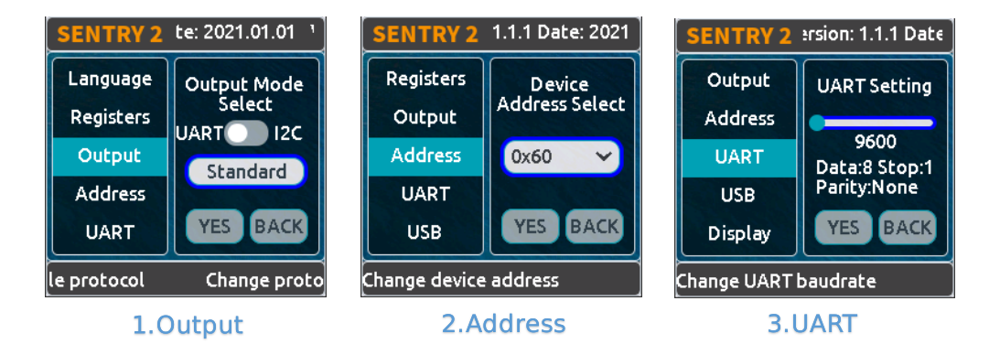

1. On the running page, click the joystick three times to the right to enter the hardware setting page
 
2. On the "Output" option, press the joystick to enter the settings
 
3. Select "UART" or "I2C" mode. Generally, if the controller cannot support high baudrate for UART mode, 
   the I2C mode will be faster, which is conducive to improving the frame rate of image processing

4. Choose the "Standard Protocol" or "Simple Protocol" in UART mode. 
   The standard protocol needs to be developed with the register and driver library, while the simple protocol only needs to send characters through the serial port
 
5. Click ”YES“ and return 

6. Toggle the joystick down to switch to the "Address" menu
 
7. Check the device address, which should be consistent with your program code, press the joystick to enter the setting, 
   the address can be set to "0x60 ~ 0x63", click "YES" and return

8. Enter the "UART" menu if you select UART mode

9. Move the slider left or right to set the uart baudrate. The baud rate of "9600, 19200, 38400, 57600, 115200, 921600, 1152000, 2000000" is supported. 
    The higher baud rate will be conducive to the improvement of the frame rate of image recognition. You need to check the max supported baudrate of your controller. When the communication is abnormal, you can reduce the baudrate

10. Click the joystick three times to the left to return the running page

USB Setting
^^^^^^^^^^^^^^^^^^^^^^^^^^^^^^^^

Sentry2 can be communication with the computer via the onboard USB port. Its baudrate can be set separately. The data communication is based on "Standard protocol" or "Simple Protocol".

**Baudrate**：Support “9600、19200、38400、57600、115200、921600、1152000、2000000” baudrate. USB can be disabled if the slider is on the left

**to UART**：Enable or Disable the data transparent transmission between USB and UART

*Tip: If the sent data belongs to the instructions in the Protocol Format, the corresponding instructions will be executed instead of being forwarded through *

Display Setting
^^^^^^^^^^^^^^^^^^^^^^^^^^^^^^^^

It is necessary to mark the recognition results when Sentry2 is running. There are 3 marks: recognition Box, coordinates X-Y and information

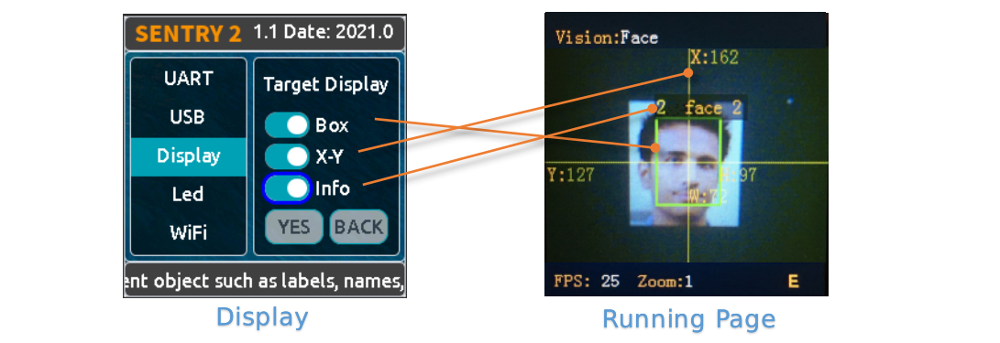

**Box**: A rectangular box showing the contour range of the measured object, whose size is the width and height of the object, and the position is determined by the center coordinate of the object

**X-Y**: Draw the horizontal and vertical coordinate lines of the measured object, and display their values, X: horizontal position, Y: vertical position, W: object width, H: object height

**Info**: Displays information about the object, such as its classification label and name

*Tip: When carrying out multi-result detection, drawing too many marks may reduce the frame rate of image detection, you can properly turn off some marks *

*Tip: Some vision do not have all the drawing elements, such as "Line detection" does not draw coordinate lines *

*Tip: If nothing result is displayed on the screen, it may be that the display function is all turned off, and you need to turn on the relevant function *

LED Setting
^^^^^^^^^^^^^^^^^^^^^^^^^^^^^^^^

The LED in front of the sensor can indicate the detection result. For each frame of image detected, the light will flash once, and the color and brightness of the light can be customized

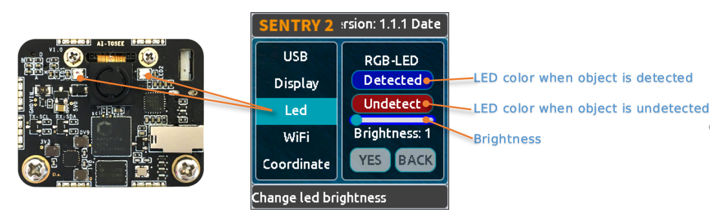

User can set the LED color when the object is "detected" or "undetected" respectively. Each time the joystick is pressed, one color will be changed. The switching sequence is as follows:

Black color means LED are turned off

When the "Detected" and "Undetected" colors are the same, the LED light will remain on and will no longer flicker

The "Brightness" range is 0 to 15, where 0 is to turn off the light and 15 is the brightest. 
If it is used as a general indicator only, the brightness can be set to 1 or 2

* Turn Off the LED
    In some cases, the light may cause interference to the image recognition (such as Color or Blob vision), at this time, the light needs to be turned off. There are two ways to turn off the LED:
    
    1. Set "Detected" and "Undetected" to black
    
    or

    1. Set "Brightness" to 0

* Fill Light
    When the environment is dark or in a backlight environment, you need to fill light:
    
    1. Set "Detected" and "Undetected" to white

    2. Set "Brightness" to 15

WiFi Setting
^^^^^^^^^^^^^^^^^^^^^^^^^^^^^^^^

The on-board ESP8285-wifi chip of the Sentry2 realizes data communication with the K210 chip through an internal UART port. When Custom Vision is enabled, the ESP8285 chip will working. The power consumption will be increases

**Baudrate**： Support “9600、74880、115200、921600、1152000、2000000、3000000、4000000” baudrate, WiFi can be disabled if the slider is on the left

**to UART**： Enable or Disable the data transparent transmission between WiFi and UART, 

**to USB**： Enable or Disable the data transparent transmission between WiFi and USB

*Tip: If the sent data belongs to the instructions in the Protocol Format, the corresponding instructions will be executed instead of being forwarded through *

Coordinate Setting
^^^^^^^^^^^^^^^^^^^^^^^^^^^^^^^^

Sentry2 supports two coordinate systems: Absolute and Percentage

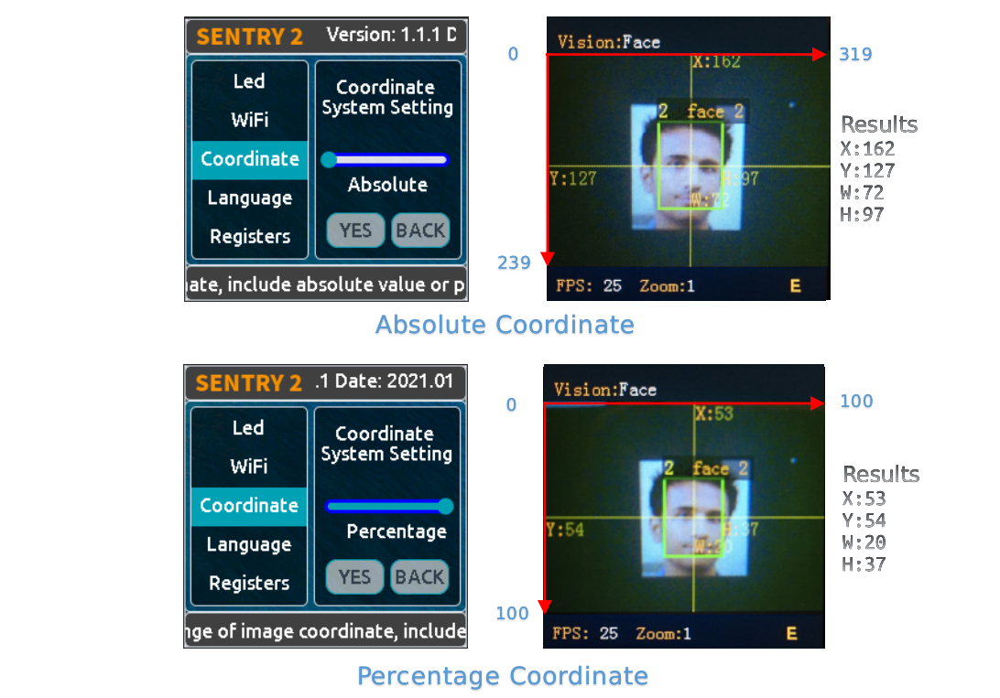

**Absolute**： In this mode, the actual coordinate results are returned. Range in horizontal direction is from "0 to 319" and "0 to 239" in the vertical direction. The center point is (160,120). This mode has higher accuracy.

**Percentage**： In this mode, the actual coordinate results are quantified to the range of "0 ~ 100". Both range in horizontal direction and vertical direction are from "0 to 100". The center point is (50,50).

Language Setting
^^^^^^^^^^^^^^^^^^^^^^^^^^^^^^^^

Sentry2 supports two system languages: English and Simplified Chinese.

Registers Setting
^^^^^^^^^^^^^^^^^^^^^^^^^^^^^^^^

Sentry2 registers can be set up for: Auto Save, Save REG, Default

.. image:: images/sentry2_set_reg_en.png 

**Auto Save**： Some registers value will be automatically stored if this function is enabled, otherwise, it will automatically reset to the default value after the next startup if it disabled. Default is disabled.

**Save REG**： Save the current register values

**Default**： Restore registers to factory settings. Click this button first and then click "YES" to make it take effect

Camera Setting
************************

Digital Zoom
^^^^^^^^^^^^^^^^^^^^^^^^^^^^^^^^

When you need to see the objects in the distance, you can zoom in or out of the image, and support 1 to 5 levels of adjustment

Increasing the zoom will make the object larger, but the field of view will be smaller and you will see less

Reducing the zoom will make the object smaller, but the field of view will be larger, allowing you to see more

User can change the zoom by joystick "upward long press" or "downward long press"

AWB - Auto White Balance
^^^^^^^^^^^^^^^^^^^^^^^^^^^^^^^^

Under different illumination (white light or yellow light), white will have a certain deviation, which will lead to the normal display of other colors. 
At this time, it is necessary to set the white balance to adjust. There are four modes: Auto, Locked, White and Yellow

Auto: This mode is the default mode and applies to common scenarios

Lock: When there is a large area of monochromatic background in the image, such as color recognition at close range, the color bias problem will occur in the image, which will lead to color recognition errors. 
Therefore, it is necessary to lock the white balance before recognition to avoid automatic color adjustment. The method is as follows:

    1. Face the camera to a white paper and keep a distance of about 20cm
    2. Enter "AWB" menu and select "Lock" mode
    3. Click "YES"
    4. Return to running page

White: Use in white light environment

Yellow: Use in yellow light environment

Saturation
^^^^^^^^^^^^^^^^^^^^^^^^^^^^^^^^

Increasing the saturation will make the color become bright, color will be strengthened and prominent

Decreasing the saturation will dull the color, and at very low levels it will look like black and white

Brightness
^^^^^^^^^^^^^^^^^^^^^^^^^^^^^^^^

You can change the brightness of the image if necessary

Contrast
^^^^^^^^^^^^^^^^^^^^^^^^^^^^^^^^

Increasing contrast will make the difference between neighboring places with color difference higher

Reducing the contrast will make the image look dull

Sharpness
^^^^^^^^^^^^^^^^^^^^^^^^^^^^^^^^

Increasing the sharpness will make the edge contour clearer and the details more obvious, but too high will produce noise

Reducing sharpness will blur the image

AEC - Auto Exposure Control
^^^^^^^^^^^^^^^^^^^^^^^^^^^^^^^^

The light intensity can reduce the exposure value when the image is exposed

On the contrary, if the environment is dark, you can increase the exposure value

Rotate
^^^^^^^^^^^^^^^^^^^^^^^^^^^^^^^^

The image will rotate 180 degrees if this is enabled

Vision Running
************************

There are several ways to Enable/Disable vision: UI, joystick, and commands

By UI Settings
^^^^^^^^^^^^^^^^^^^^^^^^^^^^^^^^

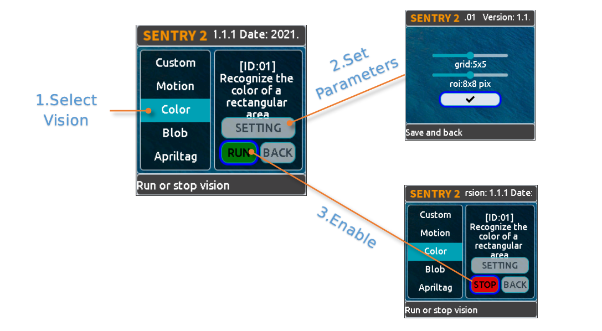

1. Select a vision to be running from the left menus of the Vision setting page

2. Some visions can be configured, click "Setting" to enter

3. If the red "Stop" button is displayed at the lower left of the right control area, it means that the algorithm is currently closed. 
   After clicking it, it will turn to the green "run" button, which means that the algorithm is started. 
   Click it again and it will turn to the red "Stop" button again.

By Joystick
^^^^^^^^^^^^^^^^^^^^^^^^^^^^^^^^

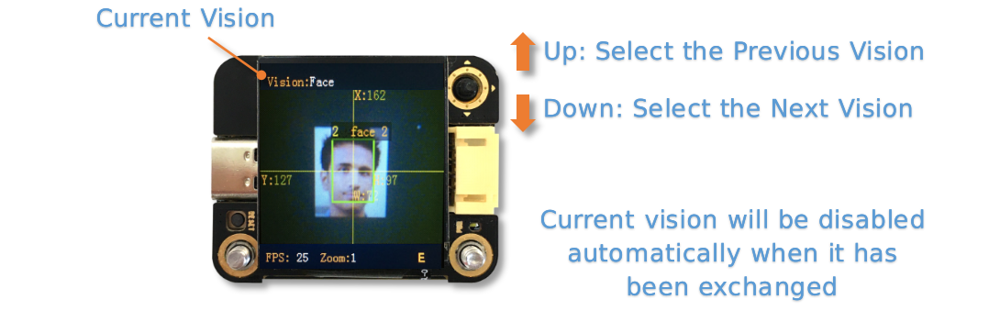

1. Short click the joystick up and down to enable or disable a vision. After each vision switch, the previous vision will be closed

2. Vision switchover sequence is sorted by Vision-ID

By Commands
^^^^^^^^^^^^^^^^^^^^^^^^^^^^^^^^

In this way, controller needs to read and write registers to enable or disable the vision. We provide the driver libraries for users to use in multiple programming platforms

In UART mode, register reading and writing must according to Standard Protocol or Simple Protocol. For details, see the related sections

I2C mode can directly read and write registers

Enable vision:
    
1. Write Vision ID to register 0x20-VISION_ID
       
2. Write 0x01 to register 0x21-VISIO_CONF1 to enable vision, otherwise, write 0x00 to disable

For details, consult the registers

Vision Result
************************

Results on the screen
^^^^^^^^^^^^^^^^^^^^^^^^^^^^^^^^

When the image detects the target object, it will be marked on the screen. The meanings of each mark are as follows

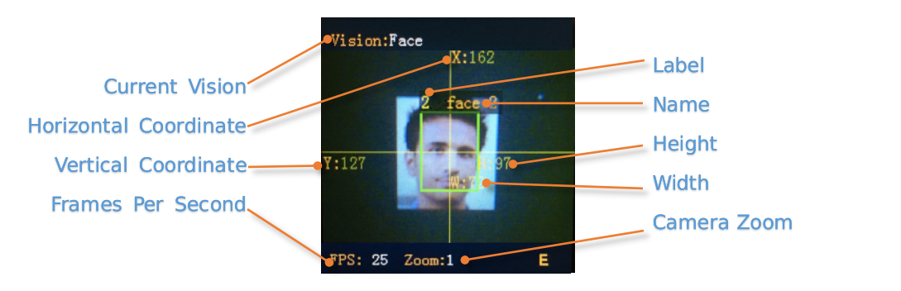

Result by Commands
^^^^^^^^^^^^^^^^^^^^^^^^^^^^^^^^

In this way, results can be read out by a controller. We provide the driver libraries for users to use in multiple programming platforms

In UART mode, register reading and writing must according to Standard Protocol or Simple Protocol. For details, see the related sections

I2C mode can directly read and write registers

Read results：
    
1. Write vision id to register 0x20-VISION_ID
    
2. Read register 0x34-RESULT_NUM to get how many objects are detected

3. Write the result id, which you want to read, to register 0x24-RESULT_ID

4. Read results by registers 0x80~0x89

    ========    ========================    ========================
    Address     Name                        Brief
    ========    ========================    ========================
    0x80        RESULT_DATA1_H8             Result 1, Hight 8 bits
    0x81        RESULT_DATA1_L8             Result 1, Low 8 bits
    0x82        RESULT_DATA2_H8             Result 2, Hight 8 bits
    0x83        RESULT_DATA2_L8             Result 2, Low 8 bits
    0x84        RESULT_DATA3_H8             Result 3, Hight 8 bits
    0x85        RESULT_DATA3_L8             Result 3, Low 8 bits
    0x86        RESULT_DATA4_H8             Result 4, Hight 8 bits
    0x87        RESULT_DATA4_L8             Result 4, Low 8 bits
    0x88        RESULT_DATA5_H8             Result 5, Hight 8 bits
    0x89        RESULT_DATA5_L8             Result 5, Low 8 bits
    ========    ========================    ========================

For details, consult the registers

Protocol
----------------

Details :ref:`Protocol<chapter_prptocol_index>` chapter

Registers
----------------

Please contact us

Support：support@aitosee.com

Sales：sales@aitosee.com

