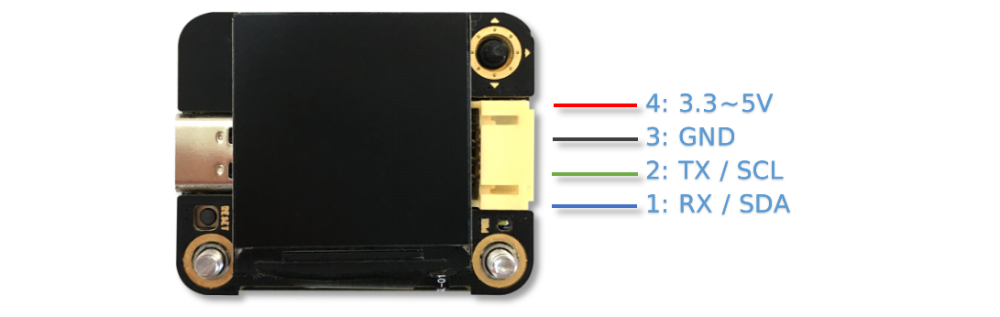
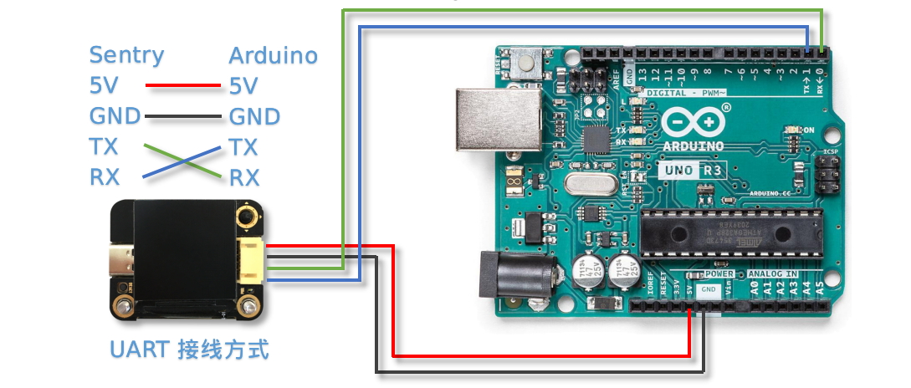
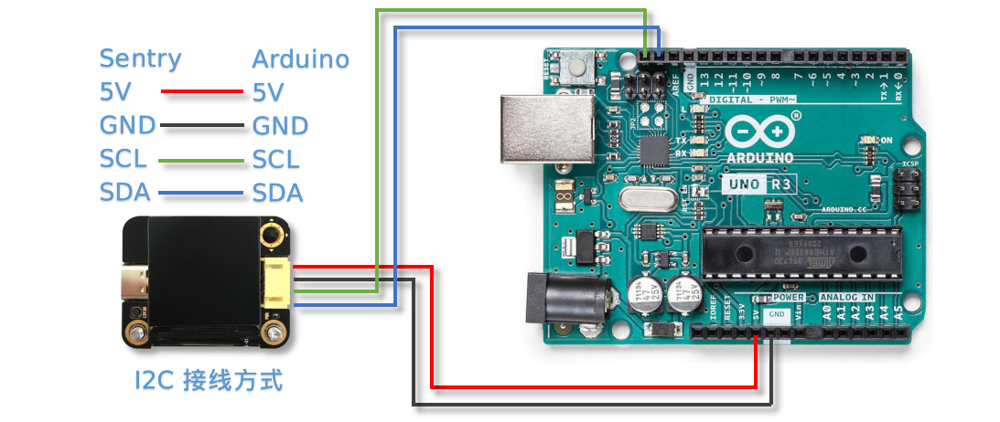
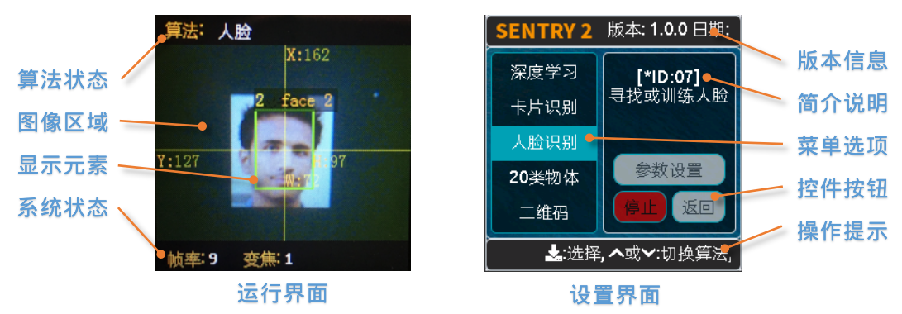
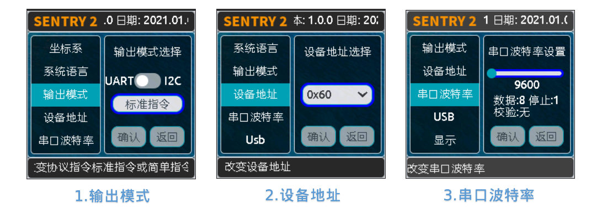
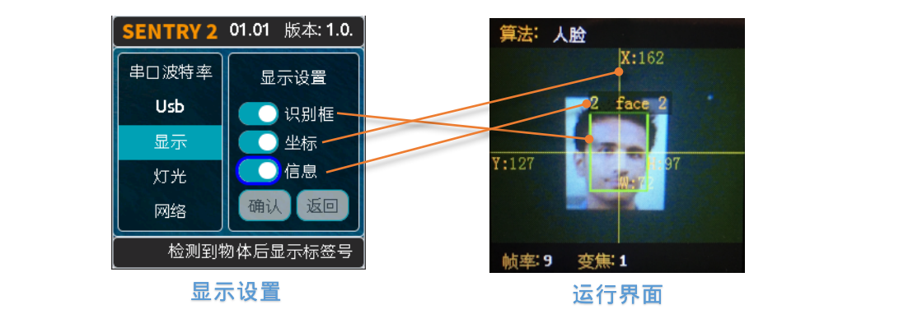
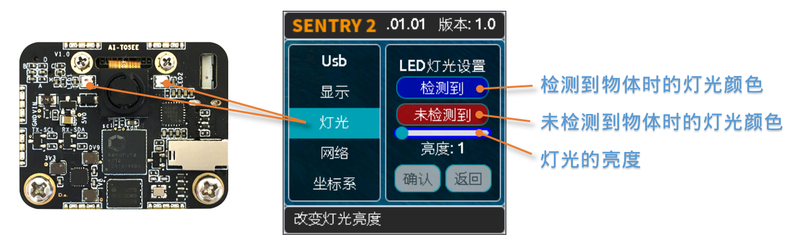
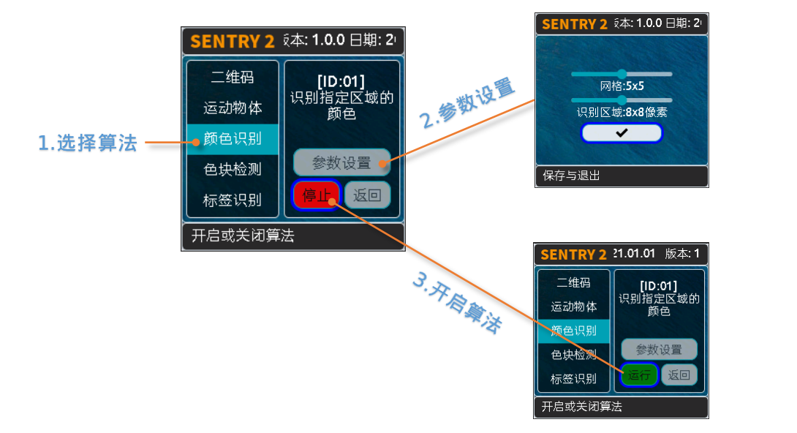
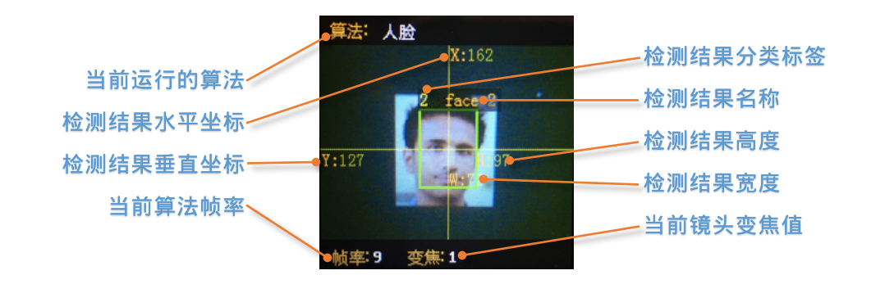

.. _chapter_vs2_hardware_index:

硬件介绍 
================

简介
----------------
Sentry2视觉传感器采用先进的64位RISC-V神经网络处理器K210开发设计，集成多种先进的离线视觉处理算法，可以满足基本的视觉处理需求。
板载ESP8285-WiFi芯片，可以直接通过Arduino进行编程开发，实现云端图像识别，无线图传，AIoT物联网等应用。ESP8285可以作为K210的协处理器，无需外接主控也可进行AI编程的学习。

目前有2个版本：企业版（标识E）、消费版（标识C）。两个版本在硬件配置和算法上有所不同，以下文档若无特殊说明，按企业版进行介绍，开机后查看屏幕右下角标识进行区分。

应用领域:智能机器人、智能小车、创意设计、STEAM教育、创客比赛、智能玩具、AIoT物联网、学校课题设计

.. image:: images/sentry2_top_bot_view.png

**LED灯**：通过灯光不同的颜色可以反映出不同的识别结果，当设置为白光常亮时可以当作补光灯使用

**摄像头**：实时的采集图像数据，Sentry2提供了摄像头设置功能，可以调节图像缩放、白平衡、亮度、饱和度等参数，满足高阶玩家需求

**WiFi天线**：传感器板载ESP8285芯片，具有WiFi无线通信功能，可以实现云端图像识别，无线图传，AIoT物联网应用等功能

**K210处理器**：带有神经网络处理单元，双核64位RISC-V处理器，在MCU级别处理其中具有十分优秀的图像处理能力

**SD卡座**：支持Micro-SD（TF）卡，用于保存图片使用，（**注意：有些SD卡并不支持，仅支持SPI通讯方式，不支持SDIO功能**）

**USB**：板载USB-UART芯片，可以直接与电脑通信与控制，同时作为固件更新接口，（**注意：USB供电会通过通讯接口对外输出，二者不可同时供电**）

**LCD屏幕**：高清广视角的TFT-ISP彩色屏幕，带来小巧而优秀的图像显示效果，方便于算法调试

**摇杆按键**：可实现“上下左右中”的5个方向的控制，提供简单实用的UI交互

**复位按键**：可实现硬件复位，特殊情况下使用

**通讯接口**：图像处理数据与主控的交互接口，支持UART和I2C方式，可以在UI界面里设置

硬件参数
----------------

================    ================    ================    ================    ================
项目                 单位                 企业版E               消费版C               备注
================    ================    ================    ================    ================
工作电压              V                   3.3～5.0             3.3～5.0            通讯口与USB不可同时供电
工作电流              mA                  190                  150                5V供电，开启人脸算法时的典型值
尺寸                 mm                  40×32×12             40x32x12.5         不带外壳
重量                 g                   15                   15                 不带外壳
定位孔间距            mm                  32                   32
定位孔直径            mm                  3                    3
摄像头类型            NA                  CMOS                 CMOS
摄像头分辨率          像素                 500W                 200W
摄像头帧率            fps                 50                   25
镜头视场角            度°                 70                   68                  
屏幕类型              NA                 TFT-ISP高清屏        TFT-ISP高清屏                   
屏幕尺寸              英寸                1.3                  1.3            
屏幕分辨率            像素                 240×240             240x240                  
================    ================    ================    ================    ================

算法列表
----------------

算法详细介绍可参阅:
:ref:`算法介绍<chapter_vision_index>`
章节

================    ================================================    ================    ================================    ================================    ====================
算法ID               名称                                                 英文名称             企业版E                               消费版C                              简介                                                                                                                           
================    ================================================    ================    ================================    ================================    ====================
1                    :ref:`颜色识别<chapter_vision_color_index>`          Color               支持                                  支持                               最高可设置25个识别区域，返回每个区域中的颜色信息，如R，G，B值及分类标签
2                    :ref:`色块检测<chapter_vision_blob_index>`           Blob                支持                                  支持                                检测图像中是否有指定的色块，支持黑、白、红、绿、蓝、黄6种色块同时检测
3                    :ref:`标签识别<chapter_vision_apriltag_index>`       Apriltag            支持                                  支持                                支持16H5，25H9,36H11编码的Apriltag标签，可以同时识别最多25个图案
4                    :ref:`线条检测<chapter_vision_line_index>`           Line                支持                                  支持                                检测图像中的线条，返回两个端点坐标及倾斜角度，可支持1～5个线段检测
5                    :ref:`深度学习<chapter_vision_learning_index>`       Learning            支持（25个数据）                        支持（15个数据）                     对任意物体进行离线训练并进行识别，可存储25个模型数据
6                    :ref:`卡片识别<chapter_vision_card_index>`           Card                支持（交通、形状、数字）                  支持（仅交通）                       识别特制的卡片图案，包含10张交通卡片，9张形状卡片，10张数字卡片
7                    :ref:`人脸识别<chapter_vision_face_index>`           Face                支持（25个数据）                        支持（15个数据）                      检测与识别人脸，支持口罩检测，可存储25个模型数据
8                    :ref:`20类物体<chapter_vision_20class_index>`        20Class             支持                                  支持                                识别常见的20类物体，如猫、汽车等
9                    :ref:`二维码<chapter_vision_qrcode_index>`           QrCode              支持                                  无                                检测与识别简单的二维码
10                   :ref:`自定义<chapter_vision_custom_index>`           Custom              支持                                  支持                                支持用户自定义算法，运行在板载ESP8285-WiFi芯片内，如云端识图
11                   :ref:`运动物体<chapter_vision_motion_index>`          Motion             支持                                  无                                判断图像中是否有移动区域
================    ================================================    ================    ================================    ================================    ====================

开发平台与驱动库
----------------

================================================    ================================    ================================    ========================================================================================================    ================    ================
开发平台                                              编程语言                             主控设备                            驱动库链接                                                                                                       企业版              消费版
================================================    ================================    ================================    ========================================================================================================    ================    ================
:ref:`Arduino<chapter_arduino_index>`               C/C++                                Arduino                            https://github.com/AITosee/Sentry-Arduino/releases                                                             支持                支持
:ref:`MakeCode<chapter_makecode_index>`             图形化                               Micro:bit                           https://github.com/AITosee/pxt-sentry/releases                                                                  支持                支持
:ref:`Mind+<chapter_mindplus_index>`                图形化，C/C++，MicroPython            Arduino、Micro:bit、掌控板             https://github.com/AITosee/ext-sentry/releases                                                                支持                支持
:ref:`Mixly<chapter_mixly_index>`                   图形化                                Arduino                             https://github.com/AITosee/Sentry-Mixly/releases                                                               支持                支持
:ref:`BXY<chapter_micropython_index>`               MicroPython                          Micro:bit、掌控板                    https://github.com/AITosee/Sentry-microPython/releases                                                         支持                支持
ARM PC                                              C/C++                               树莓派，Linux                        :download:`Sentry-Arduino-1.2.4_for_linux.zip <../Download/libs/Sentry-Arduino-1.2.4_for_linux.zip>`          支持                支持
================================================    ================================    ================================    ========================================================================================================    ================    ================

使用说明
----------------
Sentry2视觉传感器可以通过通讯接口与主控制器相连接，也可以通过USB与电脑连接。通讯接口可以在UI界面中配置为UART串口或I2C模式，还可以修改设备地址和波特率等参数。

驱动库、固件、资料手册、第三方资源等可参阅:
:ref:`资源下载<chapter_download_index>`
章节

**注意：USB与通讯接口不可以同时供电！！！**

连接主控
************************

接口定义
^^^^^^^^^^^^^^^^^^^^^^^^^^^^^^^^

================    ================    ================    ================
引脚序号              UART模式            I2C模式              备注
================    ================    ================    ================
1                   RX                  SDA
2                   TX                  SCL
3                   GND                 GND
4                   VCC                 VCC                 注意！！！当插入USB时，此端口可以对外部设备进行供电，此端口不可直接连接电池，当插入USB时不可接入3.3V系统，需要断开供电引脚
================    ================    ================    ================

接线方式
************************
以Arduino UNO举例说明

**UART模式**

**注意：UART模式下，视觉传感器的RX需要接Arduino的TX，传感器的TX接Arduino的RX**

**注意：如果使用软串口，可以指定其他的IO口，详见Arduino中的SoftSerialExample**

**注意：由于Arduino的RX和TX与烧录固件共用端口，因此在烧录程序时，需要断开RX，TX接线，推荐使用I2C或软串口模式**

**I2C模式**

UI界面
************************

Sentry2视觉传感器具有2种UI界面：运行界面、设置界面

* 运行界面

    **算法状态**:此区域用于显示当前正在运行的算法

    **图像区域**:显示摄像头的图像

    **显示元素**:对被测物体进行标识，包括检测框、坐标、信息

    **系统状态**:显示当前帧率和当前图像缩放变焦值

* 设置界面

    **菜单选项**:上下拨动摇杆来选择不同的菜单，垂直短按摇杆可以进入相应的设置页面 

    **版本信息**:此处可以查看固件版本号和固件发布日期 

    **简介说明**:对当前菜单进行介绍说明 

    **控件按钮**:各种交互按键，用于进行设置操作，不同菜单下的控件是不同的，当导航键移动到某个控件上时会进行高亮显示或蓝边显示

    **操作提示**:当摇杆悬停到不同的控件上时，会显示相应的介绍信息或操作说明，相当于说明书的作用

UI设置界面
^^^^^^^^^^^^^^^^^^^^^^^^^^^^^^^^

.. image:: images/sentry2_ui_3_pages.png

运行界面往右拨动摇杆可以进入UI设置界面，UI设置共有三个页面：算法设置、摄像头设置、硬件设置 

依次往左拨动摇杆则会逐次退出页面，直至返回运行界面

    **算法设置**:可以开启或关闭算法，配置算法参数 

    **摄像头设置**:用于调整摄像头的参数，可以对图像进行缩放、白平衡、饱和度、亮度、对比度等参数进行精细调节，需要具备一定的摄像头调参基础，适用于高阶玩家 

    **硬件设置**:用于配置通讯方式、波特率、设备地址、灯光颜色、语言等参数，以适配不同的使用模式 

硬件设置
************************

摇杆按键功能定义
^^^^^^^^^^^^^^^^^^^^^^^^^^^^^^^^
上电开机后便可以通过摇杆对视觉传感器进行操作，传感器采用5向导航摇杆，操作定义如下表所示：

================    ================    ================
当前模式              操作方式              动作含义          
================    ================    ================
运行模式              向上拨动              切换上个算法
运行模式              向下拨动              切换下个算法
运行模式              向左拨动              拍照（当插入SD时）
运行模式              向右拨动              进入GUI设置模式
运行模式              垂直短按              保存当前模型（部分算法有效）
运行模式              向上长按              放大镜头焦距Zoom
运行模式              向下长按              缩小镜头焦距Zoom
运行模式              向左长按              关闭/开启屏幕
运行模式              垂直长按              删除所有保存的模型（部分算法有效）
...
设置模式              向上拨动              切换上一个菜单或控件
设置模式              向下拨动              切换下一个菜单或控件
设置模式              向左拨动              切换上一个设置界面/返回运行模式
设置模式              向右拨动              切换下一个设置界面
设置模式              垂直短按              进入控件进行参数设置
...
开机时                向上长按10秒          重置传感器
开机时                垂直长按              进入K210固件烧录模式
开机时                向下长按              进入ESP8285固件烧录模式
================    ================    ================

*提示：拨动即为短按，长按需要至少为2秒以上的保持时间后再松开*

设置通讯方式
^^^^^^^^^^^^^^^^^^^^^^^^^^^^^^^^

用于设置视觉传感器与主控的通讯方式，设置后会自动保存，下次开机后不必再次设置，但当通讯异常时，需要检查这些参数是否被改变，有时固件更新后或调用了某些复位寄存器后会改变这些设置，此时需要重新设置

1. 在运行界面往右拨动3次摇杆，进入硬件设置界面
 
2. 在“输出模式”选项上，压按摇杆进入设置
 
3. 选择”UART“或”I2C“模式，一般来说，如果主控的UART端口无法支持高波特率，那么I2C的读取速度会更快，有利于提高图像处理帧率

4. 如果使用“UART模式”，那么还需要选择“标准指令”协议或“简单指令“协议，标准指令需要配合寄存器和驱动库进行开发，而简单指令只需要通过串口发送字符即可
 
5. 点击”确认“返回到菜单栏 

6. 往下拨动摇杆，切换到”设备地址“菜单 
 
7. 查看设备地址,此地址应与主控代码中的保持一致,压按摇杆可以进入设置，地址可设置为”0x60～0x63“， 点击”确认“并返回 

8. 如果选择”UART模式“，则还需要往下拨动摇杆，切换到”串口波特率“菜单 

9. 压按摇杆进入设置，左右拨动摇杆来设置波特率，支持“9600、19200、38400、57600、115200、921600、1152000、2000000”波特率，较高的波特率将有利于图像识别帧率的提升，不同的主控可支持的最高波特率有所差异，需要查看主控的相关说明，当通讯异常时，可尝试降低波特率，默认为9600

10. 往左拨动3次摇杆，返回至运行界面

设置USB功能
^^^^^^^^^^^^^^^^^^^^^^^^^^^^^^^^

Sentry2板载一个USB端口，可以实现与电脑的交互通讯，其波特率可单独设置，数据通信方式基于“标准协议指令”或“简单协议指令”

.. image:: images/sentry2_set_usb.png 

**波特率**：支持“9600、19200、38400、57600、115200、921600、1152000、2000000”波特率，当控件位于最左侧时可以关闭usb功能

**至UART**：开启或关闭USB与UART的数据透传功能，开启后，可以实现USB口与UART口的数据互相传输

*提示：如果发送的数据属于“协议格式”中的指令，则会执行相应的指令而不会被转发透传*

设置运行界面显示元素
^^^^^^^^^^^^^^^^^^^^^^^^^^^^^^^^

进行图像识别时，为了便于观察检测结果，需要对识别结果进行标识，Sentry2定义了3种标识元素：识别框、坐标、信息

**识别框**:显示被测物体的轮廓范围，为一个矩形的方框，其大小为物体的宽和高，位置由物体的中心坐标来确定 

**坐标**:在图像中绘制出被测物体的水平和垂直坐标线，并显示其数值，X：水平位置，Y：垂直位置，W：物体宽度，H：物体高度

**信息**:显示物体的分类标签、名称内容等信息

*提示：当进行多结果检测时，绘制太多的元素可能会降低图像检测帧率，可适当关闭部分元素绘制功能* 

*提示：有些算法并不具备所有的绘制元素，比如“线条检测”不会绘制坐标线* 

*提示：当图像中没有显示任何检测结果时，可能是显示功能全部被关闭了，需要打开相关的功能即可* 

设置LED灯光颜色
^^^^^^^^^^^^^^^^^^^^^^^^^^^^^^^^

进行图像识别时，可以通过传感器前面的LED灯光来指示检测结果，每检测一帧图像，会闪烁一次灯光，灯光颜色和亮度可以进行自定义设置

用户可以分别设置“检测到”物体时的灯光颜色和“未检测到”时的灯光颜色，每按一次控件，将会改变一个颜色，切换顺序如下：

.. image:: images/sentry2_led_color_list.png 

其中，黑色代表关闭灯光

当“检测到”和“未检测到”颜色相同时，LED灯光将保持常亮，不再闪烁

亮度调节范围为0～15,其中0为关闭灯光，15为最亮，如果只作为一般性指示功能，亮度设为1或2即可

* 关闭灯光
    在某些情况下，灯光可能会对图像识别产生干扰（如颜色类算法，近距离物体识别时，等），此时需要关闭灯光，有两种方式可以关闭的灯光：
    
    1. 将“检测到”和“未检测到”设置为黑色
    
    2. 将亮度设置为0

* 补光灯功能
    当环境较暗时，或者处于逆光环境情况下，需要开启补光灯来照明，可以按照下面的方式设置：
    
    1. 将“检测到”和“未检测到”都设为白色，此时LED灯光将保持白色常亮状态，不再闪烁

    2. 将亮度提高，比如设为最大15,此时发光最亮

设置WiFi功能
^^^^^^^^^^^^^^^^^^^^^^^^^^^^^^^^

Sentry2板载ESP8285-WiFi芯片，与K210主芯片之间通过UART实现数据通信，当开启“自定义算法”时，会启用ESP8285芯片，启用后功耗会有所增加

**波特率**：支持“9600、74880、115200、921600、1152000、2000000、3000000、4000000”波特率，当控件位于最左侧时可以关闭wifi功能

**至UART**：开启或关闭WiFi芯片与UART端口的数据透传功能，开启后，可以实现WiFi芯片与UART口的数据互相传输，可以用于WiFi芯片与主控的数据通信

**至USB**：开启或关闭WiFi芯片与USB端口的数据透传功能，开启后，可以实现WiFi芯片与USB口的数据互相传输，可以用于WiFi芯片调试日志输出

*提示：如果发送的数据属于“协议格式”中的指令，则会执行相应的指令而不会被转发透传*

设置坐标系
^^^^^^^^^^^^^^^^^^^^^^^^^^^^^^^^

Sentry2支持2种坐标系：绝对值坐标系、百分比坐标系

.. image:: images/sentry2_set_cord.png 

**绝对值坐标系**：返回图像中的实际坐标数据，与图像分辨率一致，水平方向范围“0～319”，垂直方向范围“0～239”，图像中心点坐标为（160,120），该模式具有更高的精确度。

**百分比坐标系**：将实际检测到的坐标结果量化至整幅图像“0～100”的范围区间内，返回其相对值坐标，水平X方向和垂直Y方向范围“0～100”，图像中心点坐标为（50,50）

设置系统语言
^^^^^^^^^^^^^^^^^^^^^^^^^^^^^^^^

Sentry2支持2种系统语言：英语、简体中文。当系统语言发生变化时，可以通过该选项进行切换，设置后需要重启设备以完全生效

*提示：选择简体中文时，并非所有文本都以汉字显示，例如所训练的人脸模型名称、深度学习训练的模型名称、二维码识别的字符等，暂时不支持中文显示*

设置寄存器
^^^^^^^^^^^^^^^^^^^^^^^^^^^^^^^^

可以设置Sentry内部寄存器的一些操作：自动保存，保存当前值，恢复默认值

**自动保存**：开启后，当某些寄存器发生改变时会自动存储至Flash里，如算法参数、镜头参数等，关机后下次开机依然有效。关闭后，改变的值不会自动保存在Flash里，下次开机后自动复位，默认为关闭状态。

**保存当前值**：可以手动保存当前的所有寄存器的设置参数

**恢复默认值**：恢复寄存器为出厂状态。先点击此按键，再点击“确认”后才生效

摄像头设置
************************

数码变焦
^^^^^^^^^^^^^^^^^^^^^^^^^^^^^^^^

当需要看清远处的物体时，可以对图像进行放大或缩小，支持1～5档调节

增大缩放值会让物体放大，但视野会变小，看到的东西会变少

减小缩放值会让物体缩小，但视野会变大，可以看到更多的东西

除了UI控件可以设置缩放值外，还支持导航快捷键来设置

向上长按：放大

向下长按：缩小

白平衡
^^^^^^^^^^^^^^^^^^^^^^^^^^^^^^^^

在不同光照下（白光和黄光），白色会有一定的偏差，从而导致其他颜色的正常显示，此时需要设置白平衡来进行调节，一共有4种模式：自动、锁定、白光、黄光

自动：此为默认模式，适用于通用场景

锁定：当图像中存在大面积单色背景时，比如近距离识别颜色时，会导致图像发生偏色问题，将导致颜色识别出错，因此在识别之前需要进行白平衡的锁定，避免颜色自动调节，方法如下：
    
    1. 在相同的灯光环境下，将摄像头面向白纸，保持约20cm的距离；
    2. 进入“白平衡”设置页面，选择“锁定”模式；
    3. 点击“确认”，此时摄像头会记录下当前参数值，不再自动调整；
    4. 返回运行界面

白光：白色灯光环境下使用

黄光：黄色灯光环境下使用

饱和度
^^^^^^^^^^^^^^^^^^^^^^^^^^^^^^^^

增大饱和度会让色彩变得鲜艳，色彩会被强化与突出，进行颜色检测和识别时，可以适当增大饱和度

减小饱和度会让色彩变得黯淡，很低时则类似于黑白画面

亮度
^^^^^^^^^^^^^^^^^^^^^^^^^^^^^^^^

图像过暗时可以适当提高亮度，但如果在较亮的环境下提高，则图像会变得灰白，如蒙了一层雾气一般

当面对电脑屏幕等光源时，可以适当减小亮度

对比度
^^^^^^^^^^^^^^^^^^^^^^^^^^^^^^^^

增大对比度会让相邻有色差的地方区分度更高，当进行黑白线条或二维码图案识别时，可以适当提高对比度

减小对比度会让图像看起来黯淡

锐化
^^^^^^^^^^^^^^^^^^^^^^^^^^^^^^^^

增大锐化会让边缘轮廓更清晰，细节更明显，但过高会产生噪点

减小锐化图像会变得模糊

曝光
^^^^^^^^^^^^^^^^^^^^^^^^^^^^^^^^

光线较强导致图像曝光时可以减小曝光值

反之如果环境较暗则可以增大曝光值

旋转镜头
^^^^^^^^^^^^^^^^^^^^^^^^^^^^^^^^

开启后镜头画面将旋转180度

开启算法
************************

有多种方式可以开启/关闭算法：UI界面方式，导航键方式，指令方式

通过UI界面开启算法
^^^^^^^^^^^^^^^^^^^^^^^^^^^^^^^^

1. 进入“算法设置”页面，在左侧菜单栏选择要运行的算法，点击进入

2. 有些算法具有参数配置功能，可以点击“参数设置”控件进入详情页，对该算法进行参数调整，当导航悬停在某个控件上时，UI界面下方的滚动条会显示操作提示，设置结束后，点击“确认”或“对勾”返回

3. 如果右侧控件区域左下方显示”红色停止”按钮，则代表该算法目前为关闭状态，点击后变为“绿色运行“按钮，则代表开启算法，再次点击又会变为”红色停止“

**注意**：有些算法参数配置后下次启动算法时才生效

通过导航键开启算法
^^^^^^^^^^^^^^^^^^^^^^^^^^^^^^^^

.. image:: images/sentry2_run_vision_by_stick.png 

1. 通过上下拨动导航键可以快速的切换算法，每次切换算法后，都会关闭之前的算法

2. 算法切换顺序按照算法ID排序

通过指令开启算法
^^^^^^^^^^^^^^^^^^^^^^^^^^^^^^^^

该方式需要由主控设备读写寄存器来实现算法的开启或关闭，我们在多个编程平台提供了封装好的驱动库给用户使用

串口模式需要依照“标准协议指令”或“简单协议指令”来读写控制，详见相关章节介绍

I2C模式可直接读写寄存器

算法开启流程如下：
    
1. 向寄存器 0x20-VISION_ID 写入要开启的算法ID号
    
2. 向寄存器 0x21-VISIO_CONF1 中写入0x01,即可开启算法，写入0x00则关闭算法

详细设置，请查询寄存器列表

检测结果
************************

通过屏幕查看检测结果
^^^^^^^^^^^^^^^^^^^^^^^^^^^^^^^^

当图像检测到目标物体后，会在屏幕中进行标识，各标识含义如下所示

通过指令读取检测结果
^^^^^^^^^^^^^^^^^^^^^^^^^^^^^^^^

该方式需要由主控设备读写寄存器来读取结果，我们在多个编程平台提供了封装好的驱动库给用户使用

串口模式需要依照“标准协议指令”或“简单协议指令”来读写控制，详见相关章节介绍

I2C模式可直接读写寄存器

识别结果读取流程如下：
    
1. 向寄存器 0x20-VISION_ID 写入要读取的算法ID号
    
2. 读取寄存器 0x34-RESULT_NUM 的值来获取当前检测到了几个目标物体，例如，返回2,则表明检测到了2个物体

3. 向寄存器 0x24-RESULT_ID 写入待读取的结果编号，例如，写入1代表读取第1组结果，写入2代表读取第2个组果

4. 读取寄存器 0x80~0x89 的值来获取检测结果

    ========    ========================    ========================
    地址         名称                           含义
    ========    ========================    ========================
    0x80        RESULT_DATA1_H8             检测结果1,高8位
    0x81        RESULT_DATA1_L8             检测结果1,低8位
    0x82        RESULT_DATA2_H8             检测结果2,高8位
    0x83        RESULT_DATA2_L8             检测结果2,低8位
    0x84        RESULT_DATA3_H8             检测结果3,高8位
    0x85        RESULT_DATA3_L8             检测结果3,低8位
    0x86        RESULT_DATA4_H8             检测结果4,高8位
    0x87        RESULT_DATA4_L8             检测结果4,低8位
    0x88        RESULT_DATA5_H8             检测结果5,高8位
    0x89        RESULT_DATA5_L8             检测结果5,低8位
    ========    ========================    ========================

详细设置，请查询寄存器列表

通讯协议
----------------

详见 :ref:`通讯协议<chapter_prptocol_index>` 章节

寄存器
----------------

请联系我们

技术：support@aitosee.com

销售：sales@aitosee.com

