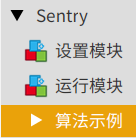

.. _chapter_mixly_index:

Sentry-Mixly
=====================

Sentry-Mixly 库是一个专门为 Mixly 图形化编程打造的驱动库，适用于 Sentry 系列产品。

开发环境安装
------------

1. 根据系统下载对应 `Mixly-v1.1.5 <https://pan.baidu.com/s/1A_k4T21rlfZpRbLttovN5A#list/path=%2F>`_
2. 下载 `Sentry-Mixly <https://github.com/AITosee/Sentry-Mixly/releases/latest>`_ ``.zip`` 库
3. 将步骤 2 中的 ``.zip`` 库解压
4. 打开 Mixly，点击 ``导入库 > 本地导入``
5. 找到步骤 3 中解压文件夹下的 ``Sentry.xml`` 文件，加载库
6. 如右下角出现 ``Sentry`` 的图标，即表示导入成功

例程
----

Mixly 例程在库的第三栏 ``算法示例``，点开即有每种算法调用的基础方法。

模块介绍
--------

1. 初始化 Sentry

    .. image:: images/mixly_sentry_init.png

    - 参数 1：端口类型
    - 参数 2：Sentry 设备地址

2. 开启/关闭算法

    .. image:: images/mixly_sentry_vision_begin.png

    - 参数 1：启用/关闭算法
    - 参数 2：算法类型

3. 获取算法检测到的结果数量

    .. image:: images/mixy_sentry_get_status.png

    - 参数 1：算法类型
    - 返回：算法检测到的结果数量

4. 获取算法检测到的物体位置

    .. image:: images/mixly_sentry_get_value.png
    .. image:: images/mixly_sentry_color_get_value.png
    .. image:: images/mixly_sentry_qrcode_get_value.png.png

    - 参数 1：算法类型
    - 参数 2：需要获取的值的类型
    - 参数 3：多个算法结果的 ID 号
    - 返回：对应类型算法检测到结果的值

    .. attention::

        需要先执行块 ``获取算法检测到的结果数量`` ，该模块相关信息才会被更新

5. 获取二维码算法识别到的字符串

    .. image:: images/mixly_sentry_get_qrcode_string.png

    - 返回：二维码算法识别到的字符串

    .. attention::

        需要先执行块 ``获取算法检测到的结果数量`` ，该模块相关信息才会被更新

6. 检查识别到的标签是否属于某类别

    .. image:: images/mixly_sentry_check_label.png

    - 参数 1：算法类型
    - 参数 2：对应的类别
    - 参数 3：多个算法结果的 ID 号
    - 返回： ``是`` 或者 ``否``

    .. attention::

        需要先执行块 ``获取算法检测到的结果数量`` ，该模块相关信息才会被更新
