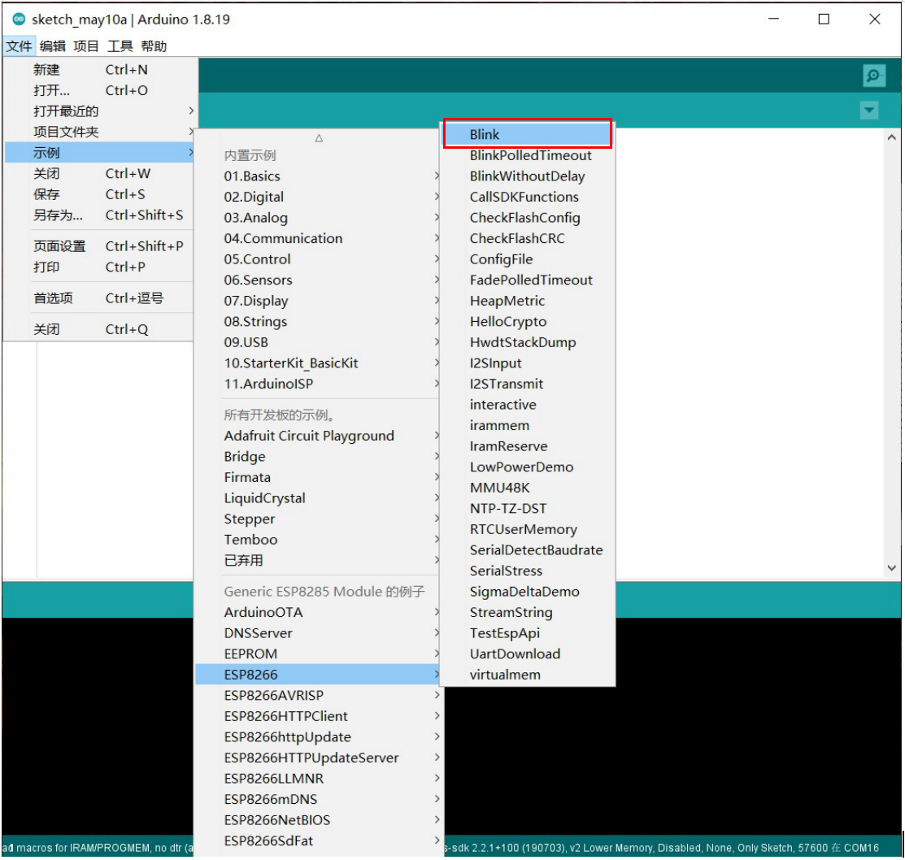

.. _chapter_wifi_index:

WiFi介绍
========

简介
----

Sentry2视觉传感器板载ESP8285-WiFi芯片，可以直接通过Arduino进行编程开发，实现云端图像识别，无线图传，AIoT物联网等应用。ESP8285可以作为K210的协处理器，无需外接主控也可进行AI编程的学习。

开发环境搭建
------------

添加ESP8266开发板
*****************

使用Sentry2的WiFi功能，首先需要下载并安装Arduino IDE程序：

https://downloads.arduino.cc/arduino-1.8.19-windows.exe

启动Arduino程序，打开“文件”>“首选项”

.. image:: images/esp8285_setup_01.png

在“附加开发板管理器网址”中填入以下网址，点击“好”保存设置

http://arduino.esp8266.com/stable/package_esp8266com_index.json

打开“工具”>“开发板”>“开发板管理器”

弹出“开发板管理器界面”，在搜索栏中输入“esp8266”并回车，可以得到如下图所示的搜索结果，选择最新的版本并点击“安装”，等待下载和安装完成后再关闭此页面

*注：下载过程可能会比较慢*

简单的测试
**********

打开“工具”>“开发板”>“ESP8266”>”Generic ESP8285 Module”，Aarduino将切换为ESP8285的开发板

加载LED Blink（闪烁）示例程序：依次打开“文件”>“示例”>“ESP8266”>“Blink”

此时，将Sentry2视觉传感器通过USB-TypeC接入电脑，打开“工具”菜单，并按照下述内容进行硬件配置，需要修改的几个项目有

Buildin Led：“4” （内置LED的IO口端号）

CPU Frequency：“80MHz”（可以根据需要设为80MHz或160MHz）

Upload Speed：“57600”	（烧录时采用的波特率，只可设为此值）

Reset Method：“no dtr (aka ck)”（烧录时硬件复位模式，只可设为此值）

选择端口：“COM xx”（选择实际使用的USB端口）

.. image:: images/esp8285_setup_07.png

向下拨动导航键不要松开（注意：不是垂直压按），点击“上传”按键开始编译和上传固件，当出现“xx%”的进度显示后，便可以松开导航键

等待固件上传成功，固件烧录至100%状态

固件烧录完后重启传感器，向上拨动导航键进入“自定义”算法，屏幕上方左侧蓝色LED灯变为常亮

观察屏幕上方内侧右边的蓝色LED的灯光变化，现象应与程序中的一致：LED亮2秒，熄灭1秒，往复如此，则表明固件烧录成功

.. image:: images/esp8285_setup_12.png

异常问题
********

如果现象与上述不符，可能原因如下：

1. 所烧录的示例程序内容是否一致，检查程序代码

2. 固件编译失败，检查是否成功加载了ESP8285的开发板

3. 固件烧录失败，比如烧录过程中断，检查通讯线，波特率和端口号，或者导航键操作不正确

4. 硬件配置不正确，比如没有指定LED端口号，仔细检查Arduino的硬件配置

5. 没有进入“自定义”算法模式，需要开启此模式才可以启动WiFi芯片，此模式需要Sentry2升级到V2.1以上的固件版本才支持，可以在UI界面上方滚动条中查看固件版本

6. 其他现象或问题，请联系我们予以解决

.. _chapter_wifi_demo_index:

示例程序
--------

提供部分开源的WiFi程序，请点击下载使用，程序内部有详细的备注说明，请仔细阅读并使用

*注意：示例程序中所涉及的第三方云平台可能需要进行注册或付费使用，请仔细阅读相关的使用条款*

*注意：本示例程序仅作为WiFi功能的使用参考，并不对第三方平台的识别性能、安全性、可用性等提供保障*

巴法云-图片云端上传-图床
************************

本示例用于实现图片上传至巴法云的图床，可以通过手机微信查看图片，也可以由第三方云端识图调用该图片地址

**注意：巴法云部分项目为收费或限制免费使用次数，请仔细阅读其官方文档和使用条款！！！！！！！！！！**

:download:`Arduino程序下载： sentry2_esp8285_bemfa_image_transfer.zip <demo/sentry2_esp8285_bemfa_image_transfer.zip>`

.. image:: images/demo_pic_bemfa_01.png

巴法云-MQTT控制Sentry2算法调用
******************************

本示例可通过MQTT的Topic主题订阅和消息推送来控制Sentry2的算法开启或关闭，以及获取检测结果

:download:`Arduino程序下载： sentry2_esp8285_bemfa_mqtt_run_vision.zip <demo/sentry2_esp8285_bemfa_mqtt_run_vision.zip>`

.. image:: images/demo_pic_bemfa_02.png

.. image:: images/demo_pic_bemfa_03.png

.. image:: images/demo_pic_bemfa_04.png

.. image:: images/demo_pic_bemfa_05.png

百度云-果蔬识别-通过图片URL方式
*******************************

本示例用于实现百度云果蔬物体的识别，其余物体识别可以根据百度云文档自行修改

本例程图片会先传输至巴法云的图床生成该图片的url链接地址，然后在百度云调用该图片的链接进行识图

如果需要识别其他物体，请参阅百度云相关的技术文档

图像识别类：https://ai.baidu.com/ai-doc/IMAGERECOGNITION/Kk3bcxbxj

文字识别类：https://ai.baidu.com/ai-doc/OCR/Ek3h7xypm

人脸识别类：https://ai.baidu.com/ai-doc/FACE/7k37c1jfr

人体分析类：https://ai.baidu.com/ai-doc/BODY/lk3cpywzd

**注意：巴法云和百度云部分项目为收费或限制免费使用次数，请仔细阅读其官方文档和使用条款！！！！！！！！！！**

:download:`Arduino程序下载： sentry2_esp8285_baidu_ingredient_classify_by_url.zip <demo/sentry2_esp8285_baidu_ingredient_classify_by_url.zip>`

百度云-果蔬识别-通过图片传输方式
********************************

本示例用于实现百度云果蔬物体的识别，其余物体识别可以根据百度云文档自行修改

Sentry2可以直接生成base64编码的jpg图片，esp8285可以通过指令进行读取

因esp8285内存大小受限，该模式采用240x180的小图片，对识别效果会有一定的影响

**注意：百度云部分项目为收费或限制免费使用次数，请仔细阅读其官方文档和使用条款！！！！！！！！！！**

:download:`Arduino程序下载： sentry2_esp8285_baidu_ingredient_classify_by_image.zip <demo/sentry2_esp8285_baidu_ingredient_classify_by_image.zip>`

百度云-车牌识别
***************

本示例用于实现百度云的车牌识别

:download:`Arduino程序下载： sentry2_esp8285_baidu_ocr_license_plate_by_image.zip <demo/sentry2_esp8285_baidu_ocr_license_plate_by_image.zip>`

百度云-OCR通用文字识别
**********************

本示例用于实现百度云的OCR通用文字识别，支持中文、英文、日文、韩文、法文、西班牙语等

:download:`Arduino程序下载： sentry2_esp8285_baidu_ocr_general_basic_by_image.zip <demo/sentry2_esp8285_baidu_ocr_general_basic_by_image.zip>`

.. image:: images/demo_pic_baidu_04.png

百度云-通用场景物体识别
***********************

本示例用于实现百度云的通用场景识别，诸如猫、狗、汽车、房子、漫画、大树、花朵、饰品等

:download:`Arduino程序下载： sentry2_esp8285_baidu_general_by_image.zip <demo/sentry2_esp8285_baidu_general_by_image.zip>`

.. image:: images/demo_pic_baidu_05.png

百度云-手势识别
***************

本示例用于实现百度云的手势识别，包含24种手势：拳头、OK、祈祷、作揖、作别、单手比心、点赞、Diss、我爱你、掌心向上、双手比心（3种）、数字（9种）、Rock、竖中指。

:download:`Arduino程序下载： sentry2_esp8285_baidu_gesture_by_image.zip <demo/sentry2_esp8285_baidu_gesture_by_image.zip>`

微软Azure-通用物体识别
**********************

本示例用于实现微软 Azure 的通用场景识别，诸如猫、狗、汽车、树等

你需要注册一个Azure帐号并开通相关的服务才可以使用，请详见其官网

Azure 主页： https://azure.microsoft.com/en-us/

**注意：Azure 部分项目为收费或限制免费使用次数，请仔细阅读其官方文档和使用条款！！！！！！！！！！**

:download:`Arduino程序下载： sentry2_esp8285_microsoft_azure_detect_objects_by_image.zip <demo/sentry2_esp8285_microsoft_azure_detect_objects_by_image.zip>`

无线图传&遥控
*************

本示例程序用于局域网内的实时图传显示以及WiFi遥控功能

当按动屏幕上的按键时，会在串口输出对应的字符，可以通过解析这些字符实现遥控小车的功能

:download:`Arduino程序下载： sentry2_esp8285_image_transfer_remoter.zip <demo/sentry2_esp8285_image_transfer_remoter.zip>`

图传界面：

带遥控按键的图传界面：

.. image:: images/demo_pic_remoter_02.png

在WiFi芯片中调用本地算法
************************

本示例程可以实现在ESP8285的芯片中控制K210的算法，使用Sentry_Arduino的标准库

因此玩家无需外接主控，也可以运行算法

:download:`Arduino程序下载： sentry2_esp8285_run_vision.zip <demo/sentry2_esp8285_run_vision.zip>`
