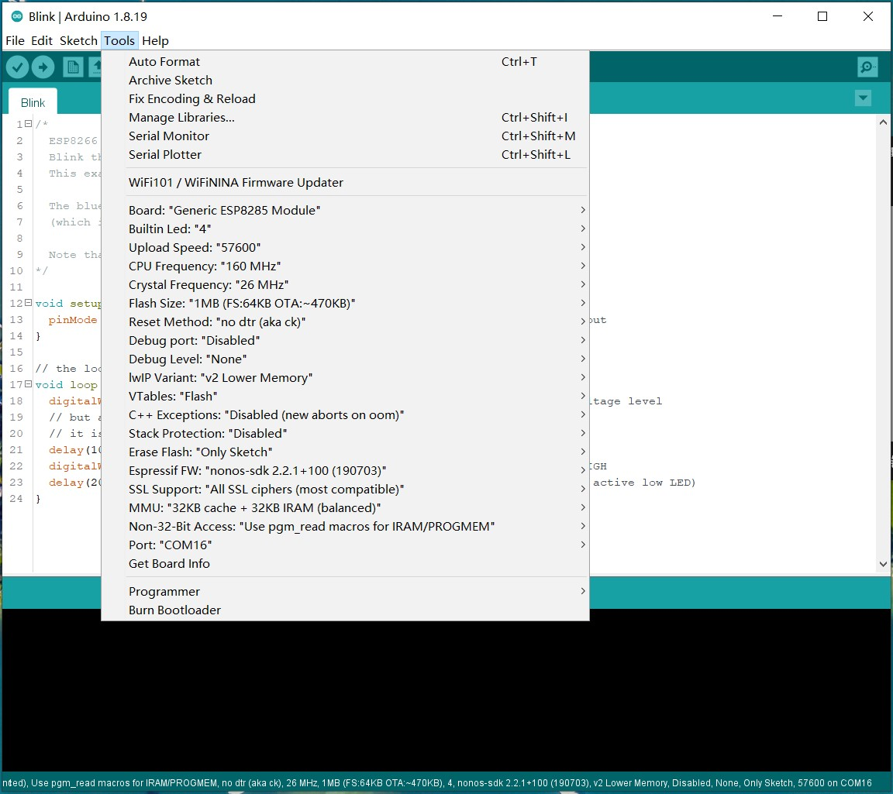

.. _chapter_wifi_index:

WiFi
========

Brief
------------

Sentry2 has an on-board ESP8285-WiFi chip which can be programmed by Arduino IDE directly to realize online-recognition, image transmission, AIoT and other applications. 
ESP8285 can be used as a controller for K210 which is help for AI programming without external device.

Development Environment
-----------------------

Add ESP8266 Board
*****************

Firstly, Download and install Arduino IDE: 

https://downloads.arduino.cc/arduino-1.8.19-windows.exe

Run Arduino IDE and Open “File” >“Preference”

Input the URL to “Additional Boards Manager URLs” and click “OK”

http://arduino.esp8266.com/stable/package_esp8266com_index.json

.. image:: images/esp8285_setup_en_02.jpg

Open“Tools”>“Board”>“Boards Manager”

Search “esp8266” and click “Install” 

Simple Test
*****************

Open “Tools”>“Board”>“ESP8266”>”Generic ESP8285 Module”

Open “File”>“Examples”>“ESP8266”>“Blink”

.. image:: images/esp8285_setup_en_06.jpg

Connect Sentry2 to PC via an USB-TypeC cable. Open “Tools” and do seme settings as shown in the bellow
Buildin Led：“4” 
CPU Frequency：“80MHz” or “160MHz”
Upload Speed：“57600”	
Reset Method：“no dtr (aka ck)”
Poart：“COM xx”(The USB Com Port)

Push the Stick button downward and hold it(NOT Vertical Press), 
Click “upload” to start compiling and uploading, 
hold the Stick button downward until the screen shows the xx% progress.

Wait firmware uploading until 100%

Restart the Sentry and runs the “Custom” vision, the Blue WiFi LED will be keep bright and the Custom LED will be blink.

.. image:: images/esp8285_setup_11.png

.. _chapter_wifi_demo_index:

WiFi Demo
----------------

  Some open source WiFi programs are provided. 

  *NOTE: The third-part AI Cloud Service may require an account or payment for use. Please read the terms of use carefully*

  *NOTE: These demos are only used as a reference for the use of WiFi function, and does not provide a guarantee for the identification performance, security, or availability*

Bemafa AIoT - Image Upload
**************************

:download:`Arduino Code: sentry2_esp8285_bemfa_image_transfer.zip <demo/sentry2_esp8285_bemfa_image_transfer.zip>`

Bemfa AIoT - MQTT for Sentry2
*****************************

:download:`Arduino Code: sentry2_esp8285_bemfa_mqtt_run_vision.zip <demo/sentry2_esp8285_bemfa_mqtt_run_vision.zip>`

.. image:: images/demo_pic_bemfa_03.png

Baidu AI - Ingredient Classify by URL
*************************************

:download:`Arduino Code: sentry2_esp8285_baidu_ingredient_classify_by_url.zip <demo/sentry2_esp8285_baidu_ingredient_classify_by_url.zip>`

.. image:: images/demo_pic_baidu_01.png

Baidu AI - Ingredient Classify by Image
***************************************

:download:`Arduino Code: sentry2_esp8285_baidu_ingredient_classify_by_image.zip <demo/sentry2_esp8285_baidu_ingredient_classify_by_image.zip>`

.. image:: images/demo_pic_baidu_02.png

Baidu AI - License Plate
************************

:download:`Arduino Code: sentry2_esp8285_baidu_ocr_license_plate_by_image.zip <demo/sentry2_esp8285_baidu_ocr_license_plate_by_image.zip>`

.. image:: images/demo_pic_baidu_03.png

Baidu AI - OCR-Optical Character Recognition
********************************************

:download:`Arduino Code: sentry2_esp8285_baidu_ocr_general_basic_by_image.zip <demo/sentry2_esp8285_baidu_ocr_general_basic_by_image.zip>`

Baidu AI - General Object Classify
**********************************

:download:`Arduino Code: sentry2_esp8285_baidu_general_by_image.zip <demo/sentry2_esp8285_baidu_general_by_image.zip>`

Baidu AI - Gesture
******************

:download:`Arduino Code: sentry2_esp8285_baidu_gesture_by_image.zip <demo/sentry2_esp8285_baidu_gesture_by_image.zip>`

.. image:: images/demo_pic_baidu_06.png

Microsoft Azure - General Object Classify
*****************************************

You need an Azure account to use this demo. Details at Azure Homepage： https://azure.microsoft.com/en-us/

:download:`Arduino Code: sentry2_esp8285_microsoft_azure_detect_objects_by_image.zip <demo/sentry2_esp8285_microsoft_azure_detect_objects_by_image.zip>`

.. image:: images/demo_pic_azure_01.png

Image Transmission and Remoter
******************************

:download:`Arduino Code: sentry2_esp8285_image_transfer_remoter.zip <demo/sentry2_esp8285_image_transfer_remoter.zip>`

.. image:: images/demo_pic_remoter_01.png

Enable Vision from WiFi Chip
****************************

:download:`Arduino Code: sentry2_esp8285_run_vision.zip <demo/sentry2_esp8285_run_vision.zip>`
