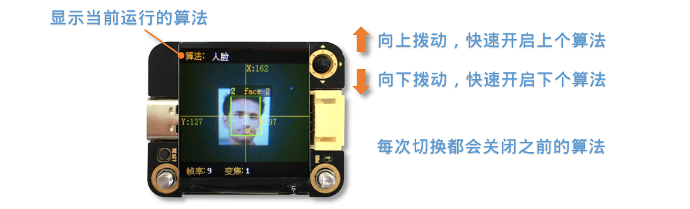

Sentry2
=======

Wellcome **Sentry2** Vision Sensor :D

Quick Start
------------------------

1. Connect Sentry2 to PC via USB-C cable
2. Up or Down click the joystick to switch vision
3. Let Sentry2 face to the object which to be recognized

Hardware
------------------------

.. toctree::
    :maxdepth: 2

    Hardware/index

Vision
------------------------

.. toctree::
    :maxdepth: 2

    Vision/index

WiFi
------------------------

.. toctree::
    :maxdepth: 2

    WiFi/index

Sentry-Arduino
------------------------

.. toctree::
    :maxdepth: 2

    ../Common/Arduino/index

Sentry-Mixly
------------------------

.. toctree::
    :maxdepth: 2

    Mixly/index

Sentry-Mind+
------------------------

.. toctree::
    :maxdepth: 2

    MindPlus/index

Sentry-MakeCode
------------------------

.. toctree::
    :maxdepth: 2

    MakeCode/index

Sentry-microPython
---------------------------

.. toctree::
    :maxdepth: 2

    microPython/index

Sentry-mPython
---------------------------

.. toctree::
    :maxdepth: 2

    ../Common/mPython/index

Demo
------------------------

.. toctree::
    :maxdepth: 2

    Demo/index

Upgrade
------------------------

.. toctree::
    :maxdepth: 2

    Upgrade/index

Download
------------------------

.. toctree::
    :maxdepth: 2

    Download/index
